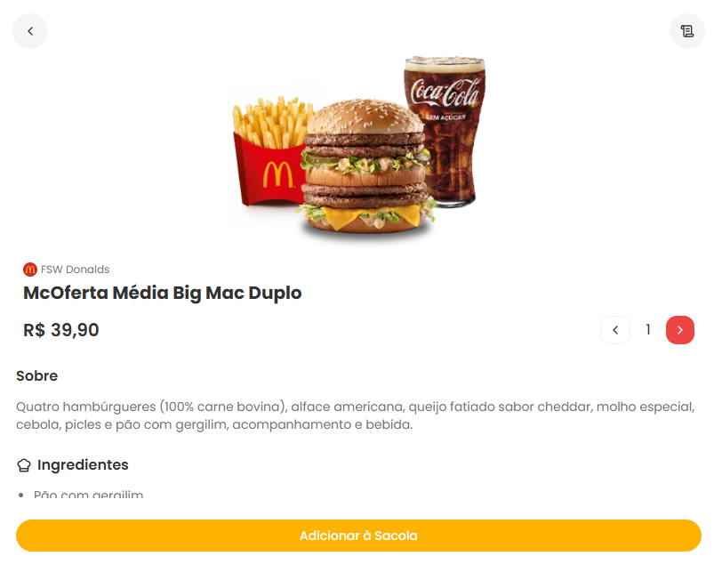

<h1 align="center">Projeto Dev Plataforma de Delivery</h1>

Aplicação inspirada em plataforma de delivery

    <a href="#-tecnologias">Tecnologias</a>&nbsp;&nbsp; &nbsp;|&nbsp;&nbsp;&nbsp;
    <a href="#-projeto">Projeto</a>&nbsp;&nbsp; &nbsp;&nbsp;&nbsp;&nbsp;

 

    

## 👨🏿‍💻 Tecnologias

Esse projeto foi desenvolvido com as seguintes tecnologias:

- Next
- Prisma
- Postgresql
- JavaScript
- TypeScript
- React
- Git e GitHub

## 💻 Projeto

FSW-Donalds é uma aplicação web full stack inspirada em plataformas de delivery, desenvolvida com foco em performance e experiência do usuário.
O sistema permite visualizar produtos, acessar menus dinâmicos, gerenciar pedidos e simular um fluxo completo de compra.

## 🍔 Donalds

https://projeto-donalds-gmte.vercel.app/fsw-donalds
